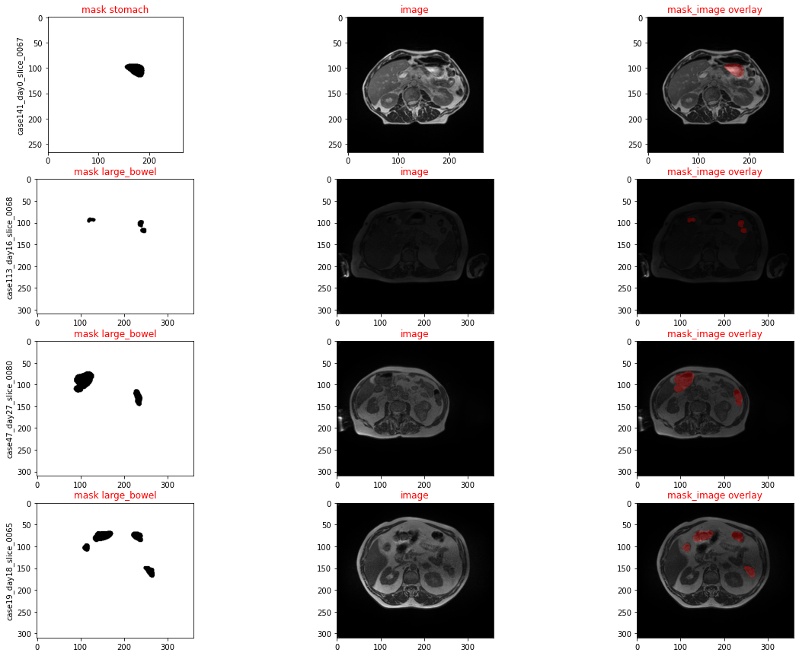

# GI-Tract-Image-Segmentation

## Content

- Introduction
- Dataset
- Visualization
- UNET Model

## Introduction

We create a model can automatically segment the stomach and intestines on MRI scans. The MRI scans are from actual cancer patients who had 1-5 MRI scans on separate
days during their radiation treatment. The objective is to develop algorithms using a dataset of these scans and to come up with creative deep learning solutions that will help cancer patients get better care.  

## [Dataset](https://www.kaggle.com/competitions/uw-madison-gi-tract-image-segmentation/data)
   In 2019, an estimated 5 million people were diagnosed with a cancer of the gastro-intestinal tract worldwide. Of these patients, about half are eligible for radiation therapy, usually delivered over 10-15 minutes a day for 1-6 weeks. Radiation oncologists try to deliver high doses of radiation using X-ray beams pointed to tumors while avoiding the stomach and intestines. With newer technology such as integrated magnetic resonance imaging and linear accelerator systems, also known as MR-Linacs, oncologists are able to visualize the daily position of the tumor and intestines, which can vary day to day. In these scans, radiation oncologists must manually outline the position of the stomach and intestines in order to adjust the direction of the x-ray beams to increase the dose delivery to the tumor and avoid the stomach and intestines. This is a time-consuming and labor intensive process that can prolong treatments from 15 minutes a day to an hour a day, which can be difficult for patients to tolerate—unless deep learning could help automate the segmentation process. A method to segment the stomach and intestines would make treatments much faster and would allow more patients to get more effective treatment.

   The UW-Madison Carbone Cancer Center is a pioneer in MR-Linac based radiotherapy, and has treated patients with MRI guided radiotherapy based on their daily anatomy since 2015. UW-Madison has generously agreed to support this project which provides anonymized MRIs of patients treated at the UW-Madison Carbone Cancer Center. The University of Wisconsin-Madison is a public land-grant research university in Madison, Wisconsin. The Wisconsin Idea is the university's pledge to the state, the nation, and the world that their endeavors will benefit all citizens.

   In this competition, you’ll create a model to automatically segment the stomach and intestines on MRI scans. The MRI scans are from actual cancer patients who had 1-5 MRI scans on separate days during their radiation treatment. You'll base your algorithm on a dataset of these scans to come up with creative deep learning solutions that will help cancer patients get better care. 
## Visualization
In this competition, the mask images are compressed by RLE algorithm. Run-length encoding (RLE) is a form of lossless data compression in which runs of data (sequences in which the same data value occurs in many consecutive data elements) are stored as a single data value and count, rather than as the original run. This is most efficient on data that contains many such runs, for example, simple graphic images such as icons, line drawings, Conway's Game of Life, and animations. For files that do not have many runs, RLE could increase the file size.

## UNET 
UNet consists of an 'encoding' and a 'decoding' part. The encoder is an alternating series of convolution-pooling layers, that extract features from the input, very much like an ordinary classifier. The decoder produces a segmentation map, based on the features derived in the encoder, by alternating transposed convolution layers (or upsampling) and convolution layers. UNet introduces skip-connections between encoder and decoder, at levels where the feature maps have the same lateral extent (number of channels). This enables the decoder to access information from the encoder, such as the general features (edges...) in the original images. The UNet network depicted in this paper is the one we used in our project. The source code for this network implemented using MONAI is provided here . I have also implemented UNet from scratch using plain pytorch (provide below). The MONAI implementation outperformed the the later. Therefore, I decied to use the MONAI UNet. The U-Net that we are using comprises 5 levels. At each stage two convolution operations are applied, each followed by an Instance normalization and the leaky ReLU activation.

We are using the U-Net model because:

- It is a very simple architecture, which means it is easy to implement and to debug.
- Compared to other architectures, its simplicity makes it faster (less trainable parameters). This is advantageous, as we want to apply the model to a relatively large dataset within a reasonable amount of time to get a first intuition about the data.
